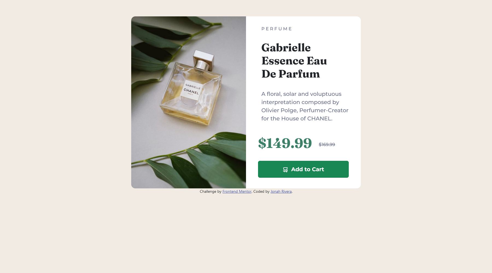

# Frontend Mentor - Product preview card component solution

This is a solution to the [Product preview card component challenge on Frontend Mentor](https://www.frontendmentor.io/challenges/product-preview-card-component-GO7UmttRfa). Frontend Mentor challenges help you improve your coding skills by building realistic projects. 

## Table of contents

- [Overview](#overview)
  - [The challenge](#the-challenge)
  - [Screenshot](#screenshot)
  - [Links](#links)
- [My process](#my-process)
  - [Built with](#built-with)
  - [What I learned](#what-i-learned)
  - [Continued development](#continued-development)
  - [Useful resources](#useful-resources)
- [Author](#author)
- [Acknowledgments](#acknowledgments)

## Overview

### The challenge

Users should be able to:

- View the optimal layout depending on their device's screen size
- See hover and focus states for interactive elements

### Screenshot




### Links

- Solution URL: [Product Solution](https://www.frontendmentor.io/solutions/product-webpage-using-bootstrap-0JNFp0BBj-)
- Live Site URL: [Product Webpage](https://bobfisherman18.github.io/product-preview-card-component/)

## My process

### Built with

- Semantic HTML5 markup
- CSS custom properties
- Flexbox
- CSS Grid
- Mobile-first workflow
-[Bootstrap](https://getbootstrap.com/)

### What I learned

I learned how to use Bootstrap for the first time! It makes styling sheets much easier. I learned how classes function in Bootstrap and what containers to use, how the grid system works, and what classes to use for the button. I was able to figure out how to remove the margins between my two columns since Bootstrap automatically calculates the margins. Bootstrap calls it gutters.

```html
<div class="row g-0">
```
```css
 .price {
        display: flex;
        align-items: center;
        justify-content: center;
        position: relative;
        top: 80px;
    }
```
### Continued development

I will continue to use Bootstrap. 

### Useful resources

- [W3Schools](https://www.w3schools.com/) - This what helped me learn HTML and CSS.
- [Youtube](https://www.youtube.com/@BroCodez) - This Youtuber also helped me learn HTML and CSS. In addition, I watched a lot of Youtube videos about HTML and CSS. Youtube is your best friend in learning web development!
- [Bootstrap](https://getbootstrap.com/) Always read the documentation!

## Author

- Website - [Jonah Rivera](https://github.com/BobFisherman18)
- Frontend Mentor - [@BobFisherman18](https://www.frontendmentor.io/profile/BobFisherman18)

## Acknowledgments

I would like to thank Frontend Mentor for giving me the opportunity to practice my front-end development!
